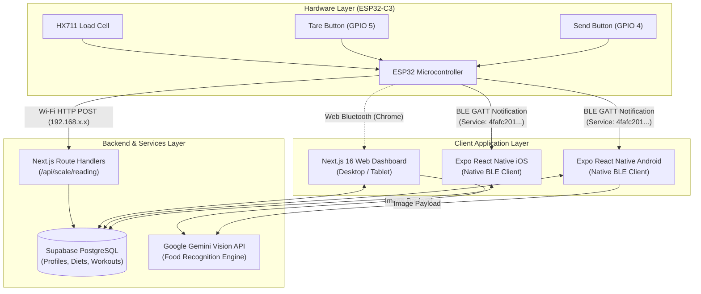
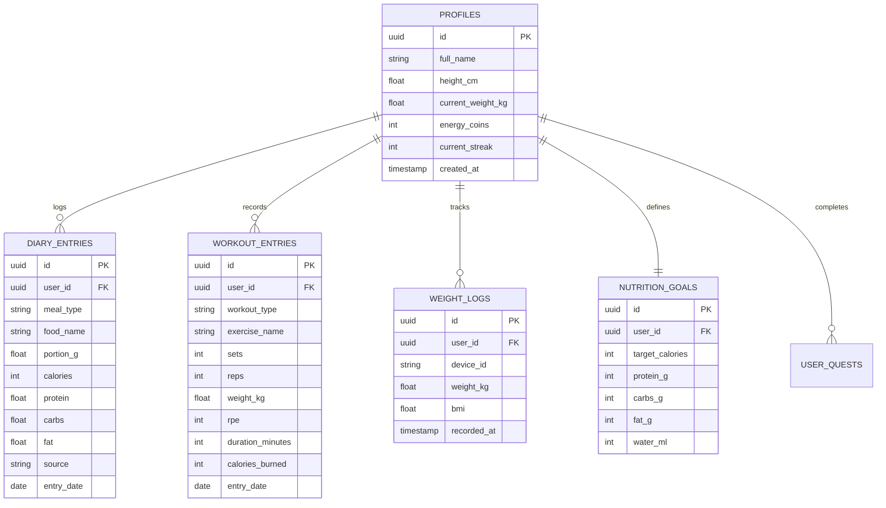

# 🏗️ FeedMe — System Architecture & Data Flow

This document details the architectural boundaries, hardware-to-software protocols, database schema, and data flows across the entire **FeedMe** ecosystem.

---

## 1. High-Level System Topology



---

## 2. IoT Smart Scale Communication Protocol

### A. Bluetooth Low Energy (BLE GATT)
- **Advertised Device Name:** `FeedMe Scale`
- **Primary Service UUID:** `4fafc201-1fb5-459e-8fcc-c5c9c331914b`
- **Weight Characteristic UUID:** `beb5483e-36e1-4688-b7f5-ea07361b26a8`
- **Properties:** Read, Notify
- **Packet Structure (JSON Base64 Encoded):**
```json
{
  "weight": 185.5,
  "unit": "g"
}
```

### B. Wi-Fi Fallback API Endpoint
- **Endpoint:** `POST /api/scale/reading`
- **Request Headers:** `Content-Type: application/json`
- **Request Body:**
```json
{
  "device_id": "scale-01",
  "weight_kg": 0.185,
  "stable": true
}
```
- **Response:**
```json
{
  "status": "success",
  "logged_at": "2026-10-10T00:25:00Z",
  "bmi": 21.4
}
```

---

## 3. Database Entity Relationship Diagram (Supabase PostgreSQL)



---

## 4. AI Engine Pipelines

### 1. Multimodal Meal Scanner Pipeline
1. **Capture:** User uploads or photographs a plate from web or mobile camera.
2. **Preprocessing:** Image resized to max 1280px width, converted to base64.
3. **Inference:** Sent to `gemini-1.5-flash` / `gemini-2.0-flash` with structured system prompt for food portion and macronutrient estimation.
4. **Correction:** User adjusts the estimated weight or accepts IoT scale weight.
5. **Ingestion:** Entry inserted into `diary_entries`.

### 2. Progressive Overload Workout Engine
1. **History Retrieval:** Fetch previous 4 sessions of the exercise (e.g., Incline Dumbbell Press).
2. **Calculation:**
   - If user completes all target sets with `RPE <= 8` $\rightarrow$ Recommend $+2.5 \text{ kg}$ next session.
   - If user achieves lower reps with `RPE >= 9.5` $\rightarrow$ Maintain weight, suggest deload or volume consolidation.
3. **Volume Load Tracking:** Compute $\sum (\text{sets} \times \text{reps} \times \text{weight})$ and visualize weekly strength trajectory.
