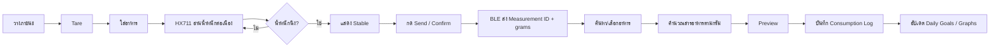
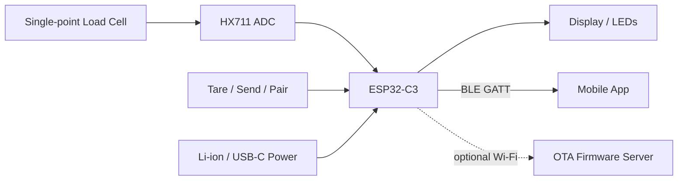
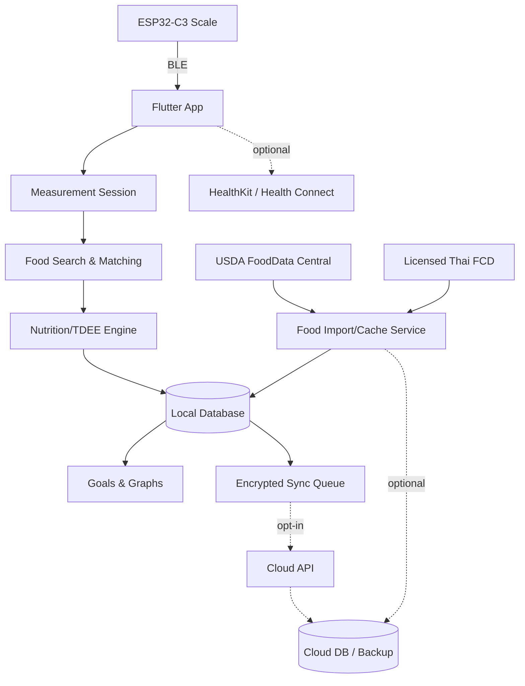
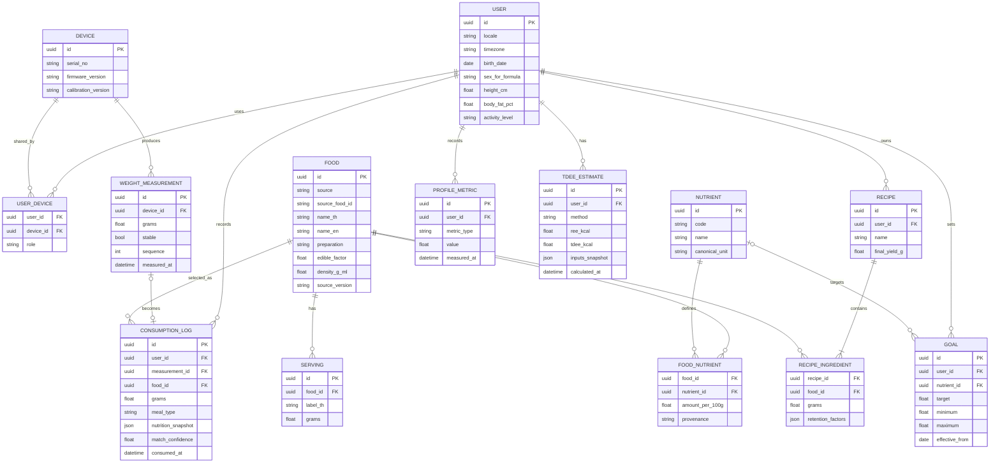
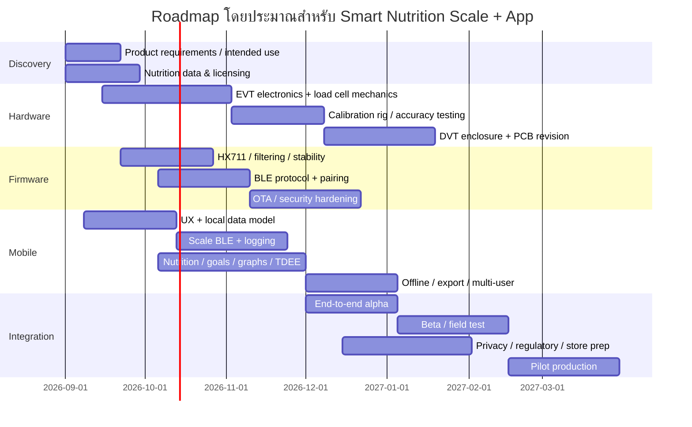

# รายงานวิจัยเชิงลึก: แอปสุขภาพร่วมกับเครื่องชั่งครัวดิจิทัลอัจฉริยะสำหรับติดตามอาหาร สารอาหาร แคลอรี และ TDEE

## บทสรุปผู้บริหาร

โครงการนี้มีความเป็นไปได้สูงทั้งในเชิงวิศวกรรมและผลิตภัณฑ์ โดยสถาปัตยกรรมที่เหมาะที่สุดสำหรับรุ่นแรกคือ **เครื่องชั่งแบบ local-first ที่ส่งน้ำหนักผ่าน Bluetooth Low Energy (BLE) ไปยังแอป iOS/Android** จากนั้นผู้ใช้ระบุว่าอาหารที่ชั่งคืออะไร เช่น “ข้าวหอมมะลิสุก 100.4 g” แอปจับคู่กับฐานข้อมูลอาหาร คูณสารอาหารตามน้ำหนักจริง บันทึกเป็นรายการบริโภค และรวมยอดเป็นกราฟรายวัน/สัปดาห์ เทียบกับเป้าหมายพลังงานและสารอาหาร ส่วน Wi‑Fi ควรเป็นความสามารถรองสำหรับ OTA firmware หรือ cloud sync ไม่ควรเป็นเส้นทางหลักในการส่งน้ำหนัก เพราะ BLE ทำงานได้แม้ออฟไลน์และไม่ต้องตั้งค่า Wi‑Fi ในครัว ขณะที่ ESP32‑C3 มีทั้ง Wi‑Fi, Bluetooth 5 LE, secure boot, flash encryption และ deep sleep 5 µA อยู่ในชิปราคาไม่กี่ดอลลาร์ จึงเหมาะมากกับผลิตภัณฑ์ประเภทนี้. citeturn25view1turn26view1

**ข้อเสนอฮาร์ดแวร์หลัก** คือ single-point load cell ช่วงประมาณ 5 kg + HX711 + ESP32‑C3 + ปุ่ม Tare/Send + จอแสดงน้ำหนักขนาดเล็กหรืออย่างน้อย LED + USB‑C และแบตเตอรี่แบบชาร์จได้ การเลือก 5 kg เป็นข้อเสนอเชิงผลิตภัณฑ์ ไม่ใช่ข้อกำหนดที่ผู้ใช้ให้มา; หากต้องการชั่งหม้อหรือภาชนะขนาดใหญ่ อาจขยับเป็น 10 kg. HX711 รองรับ output rate 10 และ 80 samples/s ขณะที่ load cell แบบ single-point เหมาะกับแท่นชั่งขนาดเล็ก และมีผลิตภัณฑ์เชิงพาณิชย์ในช่วง 3–10 kg ให้เลือกหลาย accuracy class. citeturn2search1turn26view0

**ข้อเสนอแอปหลัก** คือ Flutter สำหรับ MVP เนื่องจากใช้ codebase เดียวสำหรับ iOS/Android ขณะที่ยังเรียก native API ได้เมื่อจำเป็น ส่วน React Native ก็สมเหตุผลหากทีมมี React/TypeScript อยู่แล้ว และ native Swift/Kotlin เหมาะเมื่อข้อกำหนด background BLE หรือ platform integration เข้มมากพอที่จะคุ้มกับต้นทุนสอง codebase. Flutter ระบุอย่างเป็นทางการว่าสามารถพัฒนา iOS และ Android จาก codebase เดียว ส่วน React Native render ผ่าน native code และเข้าถึง native APIs ได้เช่นกัน. citeturn24view7turn24view8

**ด้านข้อมูลโภชนาการ** ควรใช้โครงสร้างแบบหลายแหล่งข้อมูล ไม่ควรผูกกับฐานเดียว: USDA FoodData Central เหมาะเป็นฐานสากล เพราะมี REST API, Food Search/Food Details และข้อมูลอยู่ใน public domain ภายใต้ CC0; สำหรับอาหารไทย ควรเจรจาใช้ **Thai Food Composition Database, Institute of Nutrition, Mahidol University** ซึ่งเวอร์ชันล่าสุดที่พบคือ Version 3 เดือนสิงหาคม 2025 และผ่านการทบทวนตามแนวทาง FAO/INFOODS. อย่างไรก็ตาม นี่เป็นความเสี่ยงธุรกิจสำคัญ: Thai FCD ระบุชัดว่าการใช้ที่ไม่ใช่เชิงพาณิชย์ใช้ฟรีพร้อม attribution แต่การนำไปใช้ในผลิตภัณฑ์หรือบริการเชิงพาณิชย์อาจมีค่าธรรมเนียมและควรขออนุญาตล่วงหน้า. citeturn24view0turn24view1

ระบบควรเก็บสารอาหารใน canonical basis เป็น **ต่อ 100 g ของส่วนที่กินได้** และให้ serving/cup/piece เป็นเพียง mapping ด้าน UX เนื่องจากเครื่องชั่งให้ข้อมูลเป็นกรัมโดยตรง สูตรพื้นฐานจึงง่ายและตรวจสอบย้อนกลับได้:

\[
N_{consumed}=N_{100g}\times\frac{weight_g}{100}
\]

สำหรับอาหารผสมหรือสูตรอาหาร ไม่ควรเพียงรวมตัวเลขของวัตถุดิบดิบแล้วหารน้ำหนัก ควรคำนึงถึง edible portion, cooking yield และ nutrient-retention factors ตามวิธีของ FAO/INFOODS และเก็บน้ำหนักผลผลิตหลังปรุงจริงเมื่อทำได้. citeturn24view2

TDEE ควรแยกเป็นสองขั้นอย่างชัดเจน: ประมาณ **REE/RMR/BMR** ด้วย Mifflin–St Jeor, revised Harris–Benedict หรือ Katch–McArdle แล้วจึงประมาณ TDEE จากระดับกิจกรรม. ทั้งสามสูตรเป็น “ค่าประมาณ” ไม่ใช่การวัด metabolic rate จริง; NIDDK เองใช้แบบจำลองที่ซับซ้อนกว่าสำหรับการวางแผนน้ำหนัก และระบุชัดว่าเครื่องมือดังกล่าวไม่ใช่คำแนะนำทางการแพทย์. citeturn23view0turn23view1turn23view2turn23view4

ในเชิงพาณิชย์ จุดแตกต่างที่มีคุณค่ากว่า “แอปนับแคลอรีอีกหนึ่งตัว” คือ **ลด friction ในการบันทึกปริมาณอาหาร**: ชั่ง → เลือกอาหาร → บันทึก โดยน้ำหนักถูกส่งเข้ามาอัตโนมัติ พร้อมฐานอาหารไทย การทำงานออฟไลน์ การเก็บ provenance ของสารอาหาร และ protocol ของเครื่องชั่งที่ออกแบบให้เปิดต่อยอดได้ แนวคิด smart nutrition scale มีอยู่แล้วในตลาด จึงยืนยันได้ว่าพฤติกรรมผลิตภัณฑ์นี้มี precedent; ความได้เปรียบควรมาจากคุณภาพ workflow และข้อมูล ไม่ใช่เพียงการมี Bluetooth scale. citeturn14search3turn14search7

**สมมติฐานที่ยังไม่ได้กำหนดโดยโจทย์และต้องล็อกก่อนผลิตจริง** ได้แก่ กลุ่มอายุเป้าหมาย, น้ำหนักสูงสุดและ accuracy ที่ต้องการ, เป็นโครงการเชิงพาณิชย์หรือวิจัย, จำนวนเครื่องที่จะผลิต, ประเทศที่จำหน่ายนอกเหนือจากไทย, ต้องมี cloud account หรือไม่, intended use/medical claims, รองรับเด็ก/หญิงตั้งครรภ์หรือไม่ และต้องการให้เครื่องชั่งใช้ได้โดยไม่เปิดโทรศัพท์หรือไม่ ประเด็นเหล่านี้มีผลโดยตรงต่อฐานข้อมูลที่ใช้ได้ งบ certification การออกแบบ enclosure และขอบเขตกฎระเบียบ. citeturn24view0turn27view1

**คำแนะนำโดยสรุป**

| ประเด็น | ข้อเสนอ |
|---|---|
| MCU | **ESP32‑C3** สำหรับ production; Arduino Nano ESP32 หรือ ESP32 dev board สำหรับ prototype. ESP32‑C3 มี BLE 5 + Wi‑Fi และ hardware security ในตัว. citeturn25view1turn26view2 |
| Measurement | 5 kg single-point load cell + HX711; ตั้งเป้า UX แสดงผล 1 g แต่ต้องกำหนด “validated accuracy” จากการทดสอบระบบจริง ไม่เท่ากับ display resolution. citeturn2search1turn26view0 |
| Connectivity | BLE เป็น measurement channel; Wi‑Fi เป็น OTA/cloud option. |
| App | **Flutter + local SQLite-compatible database + optional backend**. Flutter รองรับ iOS/Android จาก codebase เดียว. citeturn24view7 |
| Nutrition | USDA FDC + Thai FCD ภายใต้ license ที่ตกลง + custom foods/recipes. USDA API มี Food Search/Food Details และ CC0. citeturn24view0turn24view1 |
| Offline | logging, cached foods, favorites, custom foods, nutrient calculation และ graphs ต้องทำงานโดยไม่ใช้อินเทอร์เน็ต |
| Security | BLE encrypted pairing, encrypted local secrets, TLS เมื่อ sync, signed/verified OTA, consent/data-minimization |
| TDEE | Mifflin–St Jeor เป็น default, revised Harris–Benedict และ Katch–McArdle เป็นตัวเลือก พร้อมอธิบาย assumptions. citeturn23view2turn23view3 |
| งบฮาร์ดแวร์ | ประมาณ **US$30–75 หรือ ~฿990–2,470/เครื่อง** สำหรับ small-run BOM ก่อน VAT, ขนส่ง, tooling, certification และบรรจุภัณฑ์; เป็น engineering estimate ไม่ใช่ quotation. การแปลงใช้ BOT reference rate 32.947 บาท/USD ณ 28 ส.ค. 2026. citeturn26view3 |
| งบ R&D | MVP ที่ใช้งานจริงประมาณ **฿1.3–2.8 ล้านบาท / 5–7 เดือน**; production-ready พร้อม cloud/OTA/compliance อาจอยู่ประมาณ **฿2.5–5.5 ล้านบาทขึ้นไป / 7–10 เดือน** ภายใต้สมมติฐานทีมขนาดเล็กในไทย; เป็น planning estimate ไม่ใช่ราคาตลาดที่รับประกัน |

## ขอบเขตผลิตภัณฑ์ ฟีเจอร์ และประสบการณ์ผู้ใช้

ผลิตภัณฑ์ควรถูกออกแบบรอบ “measurement session” ไม่ใช่รอบ “การกรอก food diary” แบบดั้งเดิม กล่าวคือเมื่อผู้ใช้วางอาหารบนเครื่องชั่ง แอปเห็นน้ำหนักแบบสด เมื่อค่านิ่ง ผู้ใช้กด Send บนเครื่องหรือ Confirm ในแอป จากนั้นระบบค้นหา/เสนออาหาร เมื่อเลือกแล้วจึงคำนวณสารอาหารและ commit เป็น consumption log วิธีนี้ป้องกันข้อมูลขยะจากการยกภาชนะ วางช้อน หรือตักอาหารเพิ่มระหว่างชั่ง และยังทำให้ผู้ใช้รู้ชัดว่า “น้ำหนักไหนกำลังจะถูกบันทึก”



แยก “measurement” ออกจาก “consumption” มีข้อดีสำคัญคือหนึ่งการชั่งอาจถูกยกเลิก แก้ไข food match หรือใช้เป็นส่วนผสมในสูตรได้โดยไม่ทำลาย raw measurement และช่วยเรื่อง audit/debugging ในภายหลัง

**Feature scope ที่แนะนำ**

| ความสามารถที่โจทย์ต้องการ | พฤติกรรมที่แนะนำ | ระยะ |
|---|---|---|
| Real-time weight reception | รับ BLE stream 5–10 UI updates/s และมี stable-event แยกต่างหาก; อย่าบันทึกอาหารทุก packet | MVP |
| Item tagging | searchable food picker + Recent + Favorites + barcode สำหรับอาหารบรรจุ + Custom food | MVP |
| Nutrient lookup | ค้น Thai FCD/USDA/local cache โดยรักษา source ID และ preparation state | MVP |
| Portion scaling | canonical เป็น g; serving/piece/cup map กลับเป็น gram weight | MVP |
| Daily/weekly graphs | calories, protein/carbs/fat, fiber/sodium และ nutrients ที่เลือก; daily + 7-day view | MVP |
| Goal setting | calories, macro grams/% และ nutrient min/target/max แบบ effective-dated | MVP |
| User profiles | อายุ ส่วนสูง น้ำหนัก body-fat optional activity level timezone/locale | MVP |
| TDEE | Mifflin–St Jeor, revised Harris–Benedict, Katch–McArdle พร้อม method label | MVP |
| Multi-user | household profiles; active profile ต้องถูกเลือกชัดเจนก่อน commit | MVP หรือหลัง MVP |
| Offline | scale connection, logging, custom foods, cached foods, calculations, graphs ทำงานได้ | MVP |
| Privacy/security | local encryption/key protection, consent, delete/export, BLE security | MVP |
| Export/import | CSV สำหรับวิเคราะห์ + JSON/ZIP versioned backup สำหรับ restore | MVP |
| Notifications | meal reminder, battery, recalibration, optional goal reminder + quiet hours | MVP/Phase 2 |
| Cloud sync | opt-in backup, multi-device, household sharing | Phase 2 |
| Health integration | Apple HealthKit / Android Health Connect | Phase 2; ทั้งสองแพลตฟอร์มมี nutrition-related data types. citeturn27view5turn27view6 |
| Adaptive TDEE | ประเมิน expenditure จาก food intake + weight trend หลังมีข้อมูลต่อเนื่อง | Phase 2 |

**Multi-user ต้องแก้ที่ UX มากกว่า hardware.** ไม่ควรให้เครื่องชั่งเดาเองว่าอาหารเป็นของใคร เพราะสมาชิกครอบครัวอาจใช้เครื่องเดียวกัน ควรมี “Active profile” ในแอป และอาจมีปุ่ม profile cycle บนเครื่องในรุ่นที่มีจอ ผู้ใช้ทุกคนสามารถ pair กับ scale เดียวกันได้ แต่ log จะไม่ถูกผูกกับ user จนกว่าแอปจะ commit consumption.

**Offline-first เป็น requirement ที่ควรถือเป็นแกนหลัก** เพราะ workflow ครัวไม่ควรหยุดเพียงเพราะอินเทอร์เน็ตล่ม USDA อนุญาตให้ใช้ข้อมูล FDC ใน public domain/CC0 จึงเอื้อให้ทำ curated offline catalog ได้ ส่วน Thai FCD ต้องเคลียร์สิทธิ์การทำ local redistribution/cache สำหรับผลิตภัณฑ์เชิงพาณิชย์ก่อนออกแบบ bundle จริง. citeturn24view0turn24view1

**Suggested screens**

| หน้าจอ | เนื้อหาหลัก |
|---|---|
| Home / Today | calories consumed/remaining, macro progress, micronutrient highlights, latest meal |
| Scale | live grams, connection/battery, Tare, Stable indicator, Send |
| Food Search | Thai-first search, English alias, recent/favorites, barcode, source badge |
| Confirm Food | food description/preparation, measured g, serving equivalent, calories/macros preview |
| Meal Log | breakfast/lunch/dinner/snack timeline, edit/delete |
| Nutrition | nutrient totals, known-data coverage, daily vs weekly |
| Trends | weight, calorie average, protein/fiber, estimated TDEE |
| Goals | calorie/macros/nutrient targets, activity, goal weight optional |
| Recipes | ingredients by weight, final cooked yield, servings |
| Devices | paired scales, calibration status, firmware/battery |
| Profile | TDEE method, height/age/body fat/activity, language |
| Privacy & Data | export/import, cloud toggle, delete data/account, consent |

กราฟควรใช้ **progress bar/ring สำหรับเป้าหมายรายวัน**, bar chart 7 วันสำหรับ calorie/macronutrient consistency, line chart สำหรับน้ำหนักและ TDEE trend และ nutrient coverage indicator สำหรับรายการที่ฐานข้อมูลมีข้อมูลไม่ครบ ไม่ควรใช้สีเขียว/แดงเป็นสัญญาณเพียงอย่างเดียว; ควรมีข้อความ ไอคอน หรือลวดลายประกอบเพื่อรองรับผู้ใช้ที่มีความบกพร่องด้านการมองเห็นสี

ภาษาไทยควรเป็น first-class locale: เก็บ `name_th` และ `name_en` แยก, มี aliases เช่น “ข้าวสวย/ข้าวหอมมะลิสุก/steamed jasmine rice”, รองรับการค้นหาแบบไม่ต้องพิมพ์ตรงทุกคำ, แสดง g, kg, ml, kcal เป็นค่าเริ่มต้น และเก็บเวลา internally เป็น UTC/ISO พร้อม timezone ของผู้ใช้ เช่น Asia/Bangkok การใช้ปี พ.ศ. ควรเป็น presentation option เท่านั้น ไม่ควรเปลี่ยน canonical timestamp.

จุดสำคัญด้าน UX คือ **อย่าซ่อน uncertainty** หากผู้ใช้พิมพ์ “ข้าว” ระบบควรเสนอ “ข้าวหอมมะลิสุก”, “ข้าวขาวสุก”, “ข้าวกล้องสุก” แทนการเลือกอัตโนมัติ โดยเฉพาะอาหารที่ preparation state เปลี่ยนสารอาหารต่อ 100 g อย่างมากจากน้ำที่ดูดซึมระหว่างปรุง วิธีนี้สอดคล้องกับหลักการ food matching ของฐานข้อมูลโภชนาการที่ต้องจับคู่ชนิดและสภาพอาหารให้ใกล้กับตัวอย่างที่บริโภคจริง. citeturn9search1turn9search4

## ข้อมูลโภชนาการและอัลกอริทึม

**แหล่งข้อมูลที่แนะนำ**

USDA FoodData Central ควรเป็น backbone สากล เนื่องจาก API เป็น REST และให้ทั้ง endpoint สำหรับ Food Search และ Food Details โดย API ต้องใช้ data.gov key; ณ ข้อมูลปัจจุบัน default rate limit คือ 1,000 requests ต่อชั่วโมงต่อ IP. USDA ระบุว่าข้อมูล FDC อยู่ใน public domain และเผยแพร่ภายใต้ CC0 จึงเหมาะกับ commercial product และ offline caching มากกว่าฐานที่มี licensing restriction. citeturn24view1

Thai Food Composition Database ของสถาบันโภชนาการ มหาวิทยาลัยมหิดลควรเป็นแหล่งหลักสำหรับอาหารพื้นถิ่นไทย Version 3 เดือนสิงหาคม 2025 รวมและปรับปรุงข้อมูลจากเวอร์ชันก่อนหน้าและ Thai Food Composition Tables รวมถึงข้อมูลวิเคราะห์ในห้องปฏิบัติการช่วงปี 1997–2025 และจัดทำตาม FAO/INFOODS guidance. แต่สิทธิ์เชิงพาณิชย์ **ต้องถือเป็น go/no-go item ตั้งแต่ช่วง discovery** เพราะเว็บไซต์ระบุ commercial reproduction/use อาจมีค่าธรรมเนียมและให้ติดต่อ INMU เพื่อขออนุญาต. citeturn24view0

ดังนั้น architecture ที่ปลอดภัยที่สุดคือ:

| Layer | แหล่ง |
|---|---|
| Global generic foods | USDA Foundation/FNDDS/SR Legacy ตามความเหมาะสม. citeturn9search5turn24view1 |
| Branded products | USDA branded + barcode/GTIN เมื่อมี |
| Thai staple/prepared foods | Thai FCD ภายใต้ข้อตกลงการใช้ข้อมูล. citeturn24view0 |
| User-specific | Custom foods, recipes, label scan/manual entry |
| Offline | favorites, recents, custom foods และ catalog ที่สิทธิ์อนุญาตให้ bundle |

**Fields ที่ควร normalize**

ฐาน `Food` ไม่ควรมีเพียงชื่อและแคลอรี แต่ควรเก็บ source, source food ID, Thai/English names, aliases, brand, barcode/GTIN ถ้ามี, food category, raw/cooked/preparation description, edible fraction, nutrient basis, default serving, density หากมีการแปลง volume, data version และ provenance.

สารอาหารควรเก็บอย่างน้อย energy kcal/kJ, protein, total carbohydrate, total fat, fiber, total/added sugars เมื่อมี, sodium และ potassium; จากนั้นรองรับ saturated fat, cholesterol, calcium, iron, magnesium, phosphorus, zinc และวิตามินสำคัญตามข้อมูลที่แหล่งนั้นมีอยู่ ที่สำคัญคือ **`missing` ต้องไม่เท่ากับ `0`** เพราะฐาน food composition ไม่ได้มีผลวิเคราะห์ทุก nutrient สำหรับทุกอาหาร และค่าของอาหารจริงมี biological/analytical variability. citeturn9search25turn24view1

จึงควรแสดง:

> Fiber: 3.2 g  
> Vitamin K: — ไม่มีข้อมูลในแหล่งนี้

ไม่ใช่:

> Vitamin K: 0 mg

มิฉะนั้น weekly micronutrient graph จะให้ความมั่นใจที่ผิด ควรมีค่า `data_coverage` เช่น “ข้อมูลที่ทราบครอบคลุม 82% ของ nutrients ที่ติดตาม” เป็น metadata เพิ่มเติม.

**สูตร portion scaling**

เมื่อฐานให้ `amount_per_100g`:

\[
Amount_n = Weight_g \times \frac{Nutrient_{n,100g}}{100}
\]

ตัวอย่าง หากข้าวสุกมีพลังงานจากฐานข้อมูล \(130 kcal/100g\) และชั่งได้ 153 g:

\[
Calories = 153 \times 130/100 = 198.9 kcal
\]

ตัวเลข 130 ในตัวอย่างนี้เป็นเพียงค่าตัวอย่างทางคณิตศาสตร์ ไม่ควร hard-code เป็นค่าข้าวทุกชนิด เพราะชนิดข้าวและวิธีปรุงมีผลต่อค่าต่อ 100 g.

เมื่อผู้ใช้เลือก “1 serving”:

\[
grams = servingQuantity \times servingWeight_g
\]

จากนั้นกลับมาใช้สูตร per-100-g เดิม การทำเช่นนี้ทำให้ **gram เป็น canonical unit** และป้องกัน bug จากการมีสูตรแยกหลายชุด.

การแปลง cup/ml ควรใช้ gram-weight ของ portion ที่ฐานกำหนดหรือ food-specific density ไม่ควรถือว่าอาหารทุกชนิด 1 ml = 1 g; FAO/INFOODS มี guidance และ density resources สำหรับการแปลง volume-to-weight โดยเฉพาะ. citeturn9search14turn9search29

**อาหารผสมและสูตร**

FAO แนะนำ workflow ที่รวม ingredient weights/nutrients, ปรับ edible portion, ใช้ cooking yield และ retention factors, รวม nutrient totals และคำนวณค่าต่อ final cooked weight/serving. citeturn24view2

จึงควรใช้:

\[
RecipeNutrient_n=
\sum_i
\left(
grams_i \times
\frac{nutrient_{i,n}}{100}
\times retention_{i,n}
\right)
\]

แล้ว:

\[
RecipeNutrient_{n,100g}
=
\frac{RecipeNutrient_n}{FinalCookedYield_g}\times100
\]

การให้ผู้ใช้ **ชั่งน้ำหนักหม้อก่อนและหลังปรุง** จะมีคุณค่ามาก ตัวอย่างเช่นสูตรข้าวต้ม/แกง/ผัด น้ำระเหยหรือน้ำถูกเติมจน final mass แตกต่างจากผลรวมวัตถุดิบอย่างมาก การใช้ final cooked yield ทำให้ portion 250 g ที่ตักจริงคำนวณได้สมเหตุผลกว่า.

**การหา food match**

ลำดับแนะนำคือ barcode/source-ID exact match → user alias/history → exact normalized name + preparation → fuzzy text search → category/locale ranking. หาก confidence ต่ำ ไม่ควร auto-commit.

ตัวอย่าง score เชิงแนวคิด:

\[
Score =
0.35 NameMatch +
0.20 PrepMatch +
0.15 LocaleMatch +
0.15 UserHistory +
0.10 DataCompleteness +
0.05 SourcePreference
\]

weights นี้เป็น design proposal และควร tune จาก search logs จริง ไม่ใช่มาตรฐานทางโภชนาการ.

เมื่อผู้ใช้เลือก “ข้าวหอมมะลิสุก” หลังพิมพ์ “ข้าว” หลายครั้ง ระบบควรจำ personal alias ได้ แต่ยังเก็บ original database ID และ source version เพื่อ audit.

**TDEE**

ควรเรียกสิ่งที่สมการคำนวณก่อนว่า **RMR/REE estimate** และแสดง TDEE เป็นขั้นต่อมา เพราะ total daily expenditure ยังขึ้นกับกิจกรรมและองค์ประกอบอื่นนอก resting metabolism. ACE อธิบาย TDEE ว่าประกอบด้วย resting metabolism, thermic effect, non-exercise activity และ exercise และใช้ activity multiplier เป็นวิธีประมาณอย่างง่าย. citeturn23view2

สำหรับน้ำหนัก \(W\) kg, ส่วนสูง \(H\) cm และอายุ \(A\) ปี:

**Mifflin–St Jeor**

ชาย:

\[
RMR=9.99W+6.25H-4.92A+5
\]

หญิง:

\[
RMR=9.99W+6.25H-4.92A-161
\]

สมการ Mifflin–St Jeor ถูกพัฒนาจากการศึกษาที่ตีพิมพ์ในปี 1990 และค่าคงที่ข้างต้นเป็นรูปแบบที่ใช้งานทางวิชาชีพโดยทั่วไป. citeturn23view0turn23view2

**Revised Harris–Benedict / Roza–Shizgal**

ชาย:

\[
REE=88.362+13.397W+4.799H-5.677A
\]

หญิง:

\[
REE=447.593+9.247W+3.098H-4.330A
\]

Roza และ Shizgal ตีพิมพ์การ reevaluation ของ Harris–Benedict ในปี 1984; Maastricht UMC+ แสดง coefficients ของ revised formula ชุดนี้สำหรับการประเมิน energy expenditure. citeturn23view1turn23view3

**Katch–McArdle**

\[
BMR=370+21.6\times LBM_{kg}
\]

โดย

\[
LBM=W\times(1-\frac{bodyFat\%}{100})
\]

สูตรนี้ต้องมี lean body mass/body-fat estimate ดังนั้นแอปไม่ควรเสนอเป็น default หากผู้ใช้ไม่มี body-fat value ที่เชื่อถือได้. citeturn23view2

จากนั้นใช้:

\[
TDEE=RMR\times ActivityFactor
\]

ค่า heuristic ที่ใช้กันแพร่หลายคือ 1.2 sedentary, 1.375 lightly active, 1.55 moderately active, 1.725 very active และ 1.9 extremely active. citeturn23view2

อย่างไรก็ตาม UI ควรเขียนว่า **“Estimated TDEE”** และให้ผู้ใช้เห็น method + activity assumption ไม่ควรแสดง “คุณเผาผลาญ 2,287 kcal/day” โดยไม่มี uncertainty. ใน Phase 2 ควรเพิ่ม adaptive estimate จาก calorie intake + smoothed body-weight trend ซึ่งจะเป็น personalized feedback loop มากกว่าค่าคงที่จาก activity category; แนวคิด adaptive expenditure มี precedent ในแอปติดตามโภชนาการเชิงพาณิชย์. citeturn14search2turn14search16

สำหรับเด็ก ผู้ตั้งครรภ์ ผู้ให้นมบุตร และผู้มีภาวะทางการแพทย์ ไม่ควรใช้ goal logic ของผู้ใหญ่แบบเดียวกันโดยไม่ได้ออกแบบเฉพาะ NIDDK เองจำกัด Body Weight Planner ของตนสำหรับผู้ใหญ่อายุ 18 ปีขึ้นไปและระบุว่าไม่ใช่ medical advice. citeturn23view4

## ฮาร์ดแวร์ เครื่องชั่ง และโปรโตคอลสื่อสาร

**โครงสร้างแนะนำ**



Load cell แบบ single-point เป็นตัวเลือกที่ตรงกับ kitchen scale เนื่องจากออกแบบให้รองรับ platform load และมีรุ่น 3 kg, 5 kg และ 10 kg ในตลาด ตัวอย่างข้อมูล Phidgets แสดง 5 kg consumer-grade ที่ US$7 และรุ่น C2/C4 ที่ราคาสูงขึ้นตาม performance class; ตัวเลขนี้ควรใช้เป็น reference price เท่านั้น ไม่ใช่ production quotation. citeturn26view0

HX711 เป็น ADC/amplifier ที่แพร่หลายในงาน load cell และเอกสารผู้ผลิตระบุ selectable output rates 10/80 Hz และ programmable gains หลายระดับ. citeturn2search1

**การเลือก MCU**

| ตัวเลือก | จุดแข็ง | ข้อเสีย | ช่วงต้นทุนที่ใช้วางแผน |
|---|---|---|---|
| **ESP32‑C3 — แนะนำ** | BLE 5 + 2.4 GHz Wi‑Fi, 160 MHz RISC‑V, 400 KB SRAM, secure boot, flash encryption, crypto acceleration, deep sleep 5 µA. citeturn25view1 | Wi‑Fi active ใช้พลังงานสูงกว่า BLE-only solution; ต้องออกแบบ RF/PCB/power ให้ดี | Module retail ปัจจุบัน ~US$3.38 ที่ 1 ชิ้นและ ~US$2.54 ที่ 100 ชิ้นจาก DigiKey. citeturn26view1 |
| ESP32‑S3 | Wi‑Fi + BLE 5, dual core 240 MHz, เหมาะเมื่อมีจอ UI ใหญ่/voice/งานประมวลผลเพิ่ม. citeturn18search9 | overkill สำหรับ scale ธรรมดา, power/board complexity สูงกว่า C3 | Espressif แสดง sample module บางรุ่นราว US$2.96–5.85 ตาม memory configuration. citeturn18search3 |
| Arduino Nano ESP32 | prototype เร็ว, Arduino ecosystem, ใช้ ESP32‑S3 และ Wi‑Fi/Bluetooth. citeturn26view2 | ราคา/ขนาดไม่เหมาะ production BOM | €20.40 retail ณ วันที่ตรวจสอบ. citeturn26view2 |
| nRF52840 | BLE/multiprotocol mature, Bluetooth LE/Thread/Zigbee/NFC, เหมาะกับ BLE-only device. citeturn18search5turn18search14 | ไม่มี Wi‑Fi ใน SoC ทำให้ต้องเพิ่ม component หากต้อง OTA ผ่าน Wi‑Fi | ควรขอ quotation/module price ตาม volume; planning allowance ประมาณ US$5–10 เป็นเพียงงบประมาณภายใน ไม่ใช่ราคาผู้ผลิต |

สำหรับ scope นี้ **ESP32‑C3 ให้ Pareto point ดีที่สุด** เพราะได้ BLE สำหรับ measurement และ Wi‑Fi สำหรับ future OTA/cloud โดยไม่เพิ่ม radio chip อีกตัว พร้อม hardware security ที่เกี่ยวข้องกับ production device. citeturn25view1

**Sampling และ filtering**

แม้ HX711 ส่งได้สูงสุด 80 Hz แต่แอปไม่จำเป็นต้องเห็น 80 weight updates/s. แนวทางแนะนำคือ firmware อ่าน raw 80 Hz ในช่วง active weighing แล้วทำ median/low-pass filter ก่อนส่ง UI update 5–10 Hz หรือเลือก HX711 10 Hz เมื่อเน้น noise/power simplicity. ความสามารถ 10/80 Hz มาจาก HX711; อัตราส่ง 5–10 Hz เป็น design target ของโครงการนี้. citeturn2search1

สถานะ `stable=true` ควรเกิดเมื่อความแปรปรวนและ slope อยู่ใต้ threshold ต่อเนื่อง เช่น 500–1,000 ms:

\[
\sigma(w_{window}) < \epsilon_\sigma
\quad\land\quad
|\Delta w/\Delta t| < \epsilon_s
\]

ค่า threshold ต้องหา empirically จาก mechanical prototype ไม่ควร fix จากทฤษฎีเพียงอย่างเดียว.

**Calibration**

แนะนำให้ factory-calibrate อย่างน้อย zero + known reference mass และ validate หลายจุด เช่น 0%, 20%, 60%, 100% ของช่วงชั่ง รวมทั้ง center/corner-load testing เพราะ accuracy ของทั้งระบบขึ้นกับ load cell, mechanics, mounting, ADC, temperature, creep, hysteresis และ firmware filtering ไม่ใช่ ADC resolution เพียงอย่างเดียว. ข้อมูล load cell เชิงพาณิชย์เองระบุ repeatability, nonlinearity, hysteresis และ creep แยกจากกัน ซึ่งแสดงว่าความแม่นยำไม่สามารถสรุปจาก “24-bit HX711” เพียงตัวเดียว. citeturn26view0turn2search1

ข้อเสนอ product target สำหรับรุ่นแรกคือ:

**capacity 5 kg, display resolution 1 g และ engineering accuracy target ราว ±2 g หรือ ±0.2% ของ reading แล้วแต่ค่าใดมากกว่าในช่วงที่ validate ได้** แต่ค่าดังกล่าวเป็น **เป้าหมายการออกแบบของรายงานนี้ ไม่ใช่ specification ที่รับรองแล้ว** ต้องทำ DVT/metrology test ก่อนนำไปเขียนบนบรรจุภัณฑ์.

ช่วงน้ำหนักต่ำมาก เช่นไม่กี่กรัม ควรมี minimum validated weight และแจ้งเตือน แทนการแสดง 1 g แล้วทำให้ผู้ใช้เข้าใจว่าความแม่นยำจริง ±1 g.

**Power และ enclosure**

สำหรับ MVP ใช้ USB‑C + Li-ion/LiPo 1,000–2,000 mAh พร้อม charger/protection จะให้ UX ที่ดี แต่ต้องเพิ่ม battery safety และ shipping considerations. ทางเลือก prototype ที่ง่ายกว่าคือ AAA cells. ESP32‑C3 รองรับ deep sleep 5 µA ที่ระดับชิป แต่ battery life จริงจะขึ้นกับ regulator, display, HX711, LEDs, wake strategy และเวลาที่ radio active จึงไม่ควรคำนวณอายุแบตจากตัวเลข MCU เพียงอย่างเดียว. citeturn25view1

enclosure ควรมี top plate ทำความสะอาดง่าย, กันของเหลวไหลเข้าบริเวณ load cell/PCB, non-slip feet และ mechanical hard-stop เพื่อป้องกัน overload. หากผลิตเชิงพาณิชย์ ความแข็งของฐานและวิธีขันสกรู load cell ต้องถูกล็อกเป็น controlled assembly process เพราะมีผลต่อ calibration.

**ปุ่ม**

แนะนำสาม interaction โดยใช้เพียงสองปุ่มได้:

`Tare` กดสั้น → zero ภาชนะ  
`Send` กดสั้น → ส่ง stable weight เป็น measurement event  
`Pair` กดค้าง 3–5 วินาที → เข้า pairing mode

หากมีหลาย user บน scale และมีจอ อาจเพิ่ม long/short press เพื่อ cycle profile แต่ควรระวังความซับซ้อน.

**BLE เทียบกับ Wi‑Fi**

| ช่องทาง | ข้อดี | ข้อจำกัด | บทบาทที่แนะนำ |
|---|---|---|---|
| **BLE** | direct phone-to-scale, ไม่ต้องมี router/Internet, pairing/bonding/encryption มีใน Bluetooth Security Manager. citeturn24view6 | background behavior ต่างกันตาม OS; throughput ต่ำกว่า Wi‑Fi | **Live weight + commands + config** |
| Wi‑Fi | download firmware/cloud โดยไม่ต้องให้ app ถือ connection ตลอด | provisioning ซับซ้อนกว่าและใช้ peak power สูงกว่า | OTA/cloud optional |
| USB | deterministic, useful in factory | ไม่ใช่ wireless consumer UX | diagnostics/calibration/manufacturing |

Bluetooth Security Manager กำหนดกระบวนการ pairing, authentication, key distribution และ link encryption สำหรับ BLE อยู่แล้ว จึงควรใช้มาตรฐานนี้แทนการสร้าง encryption protocol เอง. citeturn24view6

**Pairing recommendation**

หากเครื่องมีจอ ให้ใช้ LE Secure Connections + numeric comparison/passkey. หากไม่มีจอ วิธี practical คือผู้ใช้กดปุ่ม Pair ทางกายภาพก่อน แล้วแอปยอม pair เฉพาะในช่วงเวลาสั้น พร้อม device-specific QR/onboarding secret หาก threat model ต้องการ MITM resistance เพิ่มขึ้น. อย่าปล่อย scale ให้ pair ได้ตลอดเวลา.

**GATT protocol**

แนะนำ Custom Service พร้อม characteristics เช่น:

`LiveWeight` — notify  
`MeasurementEvent` — indicate/notify  
`Command` — write  
`DeviceStatus` — read/notify  
`FirmwareInfo` — read

JSON ที่ผู้ใช้ขอสามารถใช้กับ MVP ได้:

```json
{
  "v": 1,
  "id": "m-1042",
  "seq": 8913,
  "g": 100.4,
  "stable": true,
  "tare_g": 0.0,
  "battery": 78
}
```

ACK:

```json
{
  "ack": "m-1042",
  "status": "received"
}
```

ควรแยก `received` จาก `logged`: packet ถูกมือถือรับแล้วไม่ได้แปลว่าผู้ใช้ได้เลือกอาหารและบันทึก consumption แล้ว.

JSON อาจเกิน BLE ATT payload ในบาง configuration จึงควร implement length-prefix/framing และ fragmentation ตั้งแต่แรก หรือจำกัด schema ให้สั้น เมื่อ protocol mature สามารถเพิ่ม CBOR/binary transport โดยคง semantic schema เดิม.

**Reliability**

`measurement.id` ต้อง unique และ idempotent เพื่อให้ retransmit ไม่สร้าง log ซ้ำ แนะนำ retry schedule เช่น 300 ms, 800 ms, 1.5 s เมื่อไม่มี ACK แล้วขึ้น “connection lost” แทนการ retry ไม่สิ้นสุด ลำดับนี้เป็น engineering proposal ที่ต้อง tune จาก field testing.

เป้าหมาย latency ที่สมเหตุผลคือ live display รู้สึกทันทีและ stable-send → app preview **ต่ำกว่า ~250 ms ใน connection ที่ดี** แต่ตัวเลขนี้ควรถือเป็น product target ไม่ใช่ guarantee.

**OTA**

ESP-IDF มี `esp_https_ota` API สำหรับ firmware upgrade ผ่าน HTTPS พร้อม server-certificate verification จึงสามารถสร้าง signed/version-controlled OTA path ได้โดยไม่ต้องออกแบบ updater protocol ใหม่ทั้งหมด. citeturn24view5

Production firmware ควรมี A/B OTA partitions, rollback เมื่อ boot ใหม่ล้มเหลว, version monotonicity, image signing/secure boot และห้าม downgrade ไป firmware ที่มีช่องโหว่โดยไม่ตั้งใจ ESP32‑C3 มี secure boot และ flash encryption เป็น hardware-supported capabilities. citeturn25view1

**BOM ประมาณการ**

ตัวเลขต่อไปนี้เป็น **engineering budget สำหรับ prototype/small-run** ไม่ใช่ supplier quotation. Reference prices แสดงว่า ESP32‑C3 module อยู่ราว US$2.54 ที่ 100 ชิ้น, load cell 5 kg ตัวอย่างหนึ่ง US$7 และอัตรา BOT ล่าสุดก่อนวันรายงานคือ 32.947 บาท/USD ณ 28 สิงหาคม 2026. citeturn26view0turn26view1turn26view3

| รายการ | ช่วงประมาณ/เครื่อง | หมายเหตุ |
|---|---:|---|
| 5 kg single-point load cell | US$4–18 | quality/accuracy/supplier dependent; Phidgets reference US$7. citeturn26view0 |
| HX711 + analog support | US$2–10 | module สำหรับ prototype แพงกว่า bare-device production |
| ESP32‑C3 module | US$2.5–4 | current distributor reference US$2.54/100, US$3.38/1. citeturn26view1 |
| Custom PCB/passives/connectors | US$3–8 | estimate |
| USB‑C/regulation/charging | US$2–5 | estimate |
| Battery | US$4–10 | estimate |
| LCD/OLED/segment display | US$2–6 | optional |
| Buttons/LED/buzzer | US$1–3 | estimate |
| Top plate + enclosure | US$5–20 | highest variability |
| Screws/feet/mechanical parts | US$1–3 | estimate |
| Assembly/calibration/test | US$4–15 | depends on volume/test fixture |
| **รวมโดยประมาณ small-run** | **US$30–75 ≈ ฿990–2,470** | ก่อน VAT, shipping, packaging, certification, tooling |
| **prototype ด้วย dev boards** | **US$45–100 ≈ ฿1,480–3,295** | สูงกว่า production PCB |

## สถาปัตยกรรมแอป ข้อมูล และความปลอดภัย

**ข้อเสนอ stack**

Mobile: Flutter/Dart  
Local data: SQLite-compatible relational DB  
BLE: native-backed Flutter plugin ที่ทีม audit/maintain ได้  
Backend: optional API + relational database/object storage  
Firmware: ESP-IDF สำหรับ production  
Cloud: vendor-neutral REST/JSON API; storage region/retention เลือกตาม compliance policy

Flutter ระบุว่า codebase เดียวสามารถ deploy ไป iOS/Android และมีระบบ platform integration สำหรับความสามารถเฉพาะ OS จึงเหมาะกับโครงการที่ business logic ส่วนใหญ่เหมือนกันแต่ BLE/background/Health APIs อาจต้องมี native bridge บางส่วน. citeturn24view7

React Native ก็สร้าง Android/iOS โดยใช้ React และ render ผ่าน native code พร้อมเข้าถึง native platform APIs จึงไม่ใช่ตัวเลือกที่ผิด โดยเฉพาะทีมเว็บที่ใช้ TypeScript อยู่แล้ว. citeturn24view8

| Framework | Pros | Cons | Relative mobile effort* |
|---|---|---|---:|
| **Flutter** | codebase เดียว, UI/graphs สม่ำเสมอ, native bridge ได้. citeturn24view7 | ต้อง validate BLE/background plugins จริงบน device matrix | **1.0×** |
| React Native | React/TS ecosystem, native rendering/APIs. citeturn24view8 | native-module dependency และ upgrades ต้องบริหาร | 1.0–1.2× |
| Native Swift + Kotlin | control CoreBluetooth/Android BLE สูงสุด | UI/domain logic สองชุด, QA เพิ่ม | 1.4–1.8× |

\*Relative effort เป็น planning estimate ของรายงาน ไม่ใช่ benchmark อย่างเป็นทางการ.

**Local-first architecture**



USDA ระบุว่า API key ไม่ควรถูกเผยแพร่สาธารณะและ key ที่พบ online อาจถูก deactivate ดังนั้นหากแอปใช้ FDC API แบบ production ในปริมาณจริง ควร proxy ผ่าน backend หรือใช้ curated downloadable data/cache แทนการฝัง secret API key ใน mobile binary. citeturn24view1

**Cloud ไม่จำเป็นต่อ MVP** ถ้า requirement คือคนหนึ่งใช้โทรศัพท์หนึ่งเครื่อง การทำ local-first ลด privacy surface, cloud bill และ outage dependency. Backend เริ่มมีคุณค่าเมื่อเพิ่ม multi-device sync, household sharing, account recovery, centralized food search, remote feature config หรือ analytics.

**ER diagram**



คอลัมน์ที่มีคุณค่ามากเป็นพิเศษคือ `nutrition_snapshot` ใน `ConsumptionLog`. ไม่ควร recalculates ประวัติย้อนหลังจาก Food table ทุกครั้ง เพราะฐานข้อมูลอาหารอาจแก้ไข nutrient values ภายหลัง ผู้ใช้ควรยังเห็นว่า “ในวันที่บันทึก แอปใช้ค่าอะไร” ขณะเดียวกันก็เก็บ `food_id/source_version` ไว้ audit ได้.

**Export/import**

ควรมีสองรูปแบบ:

CSV สำหรับผู้ใช้เปิดด้วย spreadsheet/data analysis โดยมี timestamp, food, grams, kcal/macros และ source ID

Versioned JSON/ZIP backup สำหรับ restore ทั้ง profile/goals/custom foods/recipes/logs โดย schema ต้องมี `export_version`.

หากไฟล์ backup มีข้อมูลสุขภาพ/น้ำหนักส่วนบุคคล การ export แบบ encrypted archive พร้อม passphrase ควรมีเป็นตัวเลือก.

**Security model**

BLE link ใช้ pairing/bonding + encryption ตาม Bluetooth Security Manager. citeturn24view6

Cloud transport ใช้ HTTPS/TLS และ OTA ใช้ certificate verification; ESP-IDF รองรับ HTTPS OTA โดยตรง. citeturn24view5

local cryptographic keys ควรเก็บใน platform-protected keystore แทนการ hard-code ในแอป และหากมี account cloud ควรแยก authentication token จาก nutrition database encryption key.

Device identity ควรมี random serial/device ID ไม่ควร broadcast ชื่อผู้ใช้หรือน้ำหนักล่าสุดใน BLE advertisement.

Logs ควรหลีกเลี่ยง PII และไม่ส่ง food diary/weight ใน crash telemetry โดย default.

Delete-account workflow ต้องลบหรือ anonymize server-side copy ตาม retention policy ไม่ใช่เพียง logout.

## กฎระเบียบ ความเป็นส่วนตัว และคุณภาพข้อมูล

**Medical-device status ยังระบุไม่ได้จากโจทย์**

นี่เป็นข้อจำกัดสำคัญที่สุดด้าน regulatory. Thai FDA ระบุว่าขั้นแรกสำหรับผู้ผลิต/ผู้นำเข้าคือพิจารณาว่าผลิตภัณฑ์เข้าข่าย “เครื่องมือแพทย์” หรือไม่ และหากไม่แน่ใจสามารถยื่นให้ Thai FDA พิจารณาสถานะได้; สำหรับสิ่งที่เป็น medical device ประเทศไทยใช้การแบ่งความเสี่ยงสี่ระดับที่สอดคล้องกับ ASEAN Medical Device Directive. citeturn27view0turn27view1

ดังนั้นไม่ควรตัดสินจาก hardware ว่า “เป็น” หรือ “ไม่เป็น” medical device เท่านั้น แต่ต้องดู **intended use และ claims** ตัวอย่างความแตกต่าง:

“ช่วยบันทึกอาหาร แคลอรี และเป้าหมายสุขภาพทั่วไป” มี regulatory posture ต่างจาก

“วินิจฉัยภาวะขาดสารอาหาร”, “กำหนด insulin dose”, “รักษาโรคอ้วน”, หรือ “ใช้สำหรับ clinical nutrition management”.

ก่อน launch ควรมี controlled document หนึ่งฉบับชื่อประมาณ `Intended Use & Claims Matrix` ที่ทีม product/marketing/legal ใช้ร่วมกัน และหากยังมีความคลุมเครือให้ขอ product determination จาก Thai FDA. citeturn27view1

**PDPA**

ข้อมูลเช่น food log อย่างเดียวอาจมีบริบทหลายแบบ แต่โปรไฟล์ที่มีน้ำหนัก body-fat goal และข้อมูลสุขภาพสามารถเข้าข่ายข้อมูลสุขภาพได้ หน่วยงานรัฐไทย DGA ระบุ “ข้อมูลสุขภาพ” เป็นข้อมูลส่วนบุคคลอ่อนไหว และระบุว่าการเก็บ ใช้ หรือเปิดเผยต้องมีความจำเป็นและมีฐานกฎหมายรองรับหรือได้รับความยินยอมโดยชัดแจ้งตาม PDPA. citeturn27view3

เชิงผลิตภัณฑ์จึงควรออกแบบตั้งแต่วันแรกให้มี data minimization, purpose limitation, privacy notice ภาษาไทยที่อ่านรู้เรื่อง, consent แยกจาก marketing consent, สิทธิ์เข้าถึง/export/delete, retention schedule และ incident-response process ไม่ควรทำ cloud sync โดยบังคับหาก core function สามารถทำ local ได้.

สำหรับ household mode ต้องระวังเพิ่มเติมว่าเจ้าของโทรศัพท์อาจเห็น food/weight history ของคนอื่น ควรมี profile PIN/biometric lock เป็น option และอย่าใช้ shared household dashboard ที่เปิด sensitive metrics ทุกคนโดย default.

**Nutrition accuracy**

food composition database ไม่ใช่การตรวจวิเคราะห์อาหารจานที่ผู้ใช้กำลังถืออยู่จริง ค่าอาหารเปลี่ยนได้ตามพันธุ์ แหล่งผลิต สูตร วิธีปรุง ปริมาณน้ำ และความแปรปรวนในการวิเคราะห์ ดังนั้น UX ควรเรียกผลเป็น “ค่าประมาณจากฐานข้อมูล” และเก็บ source/provenance. FAO/INFOODS เน้นทั้ง food matching และวิธีคำนวณสูตรอาหารเพื่อจัดการความแตกต่างนี้. citeturn9search1turn9search25turn24view2

อาหารบรรจุควรให้ข้อมูลจากฉลาก/ฐาน branded food มี priority เมื่อ barcode ตรงกับสินค้าจริง แทนการใช้ generic food โดยไม่บอกผู้ใช้ และต้องเก็บ serving size กับ basis ให้ครบ.

กฎการแสดงข้อมูลโภชนาการอาหารในประเทศไทยมีการปรับปรุงล่าสุดที่หน้า Thai FDA แสดง Notification No. 467 B.E. 2568 (2025) เรื่อง Nutrition Labelling และ No. 466 B.E. 2568 สำหรับผลิตภัณฑ์ที่ต้องมี nutrition/GDA labeling ดังนั้นก่อนทำฟีเจอร์ “จำลองฉลากโภชนาการ” หรือเผยแพร่ข้อมูลบนบรรจุภัณฑ์ ควรแยกข้อกำหนดทางกฎหมายออกจาก dashboard tracking ทั่วไป. citeturn27view2

ข้อความ disclaimer ที่เหมาะสม เช่น:

> “ข้อมูลพลังงานและสารอาหารเป็นค่าประมาณจากฐานข้อมูลและข้อมูลที่ผู้ใช้เลือก องค์ประกอบของอาหารจริงอาจแตกต่างกัน ผลิตภัณฑ์นี้ไม่ได้ใช้แทนการตรวจวินิจฉัยหรือคำแนะนำจากแพทย์/นักกำหนดอาหาร”

ควรมี disclaimer เพิ่มสำหรับ TDEE ว่าเป็นค่าประมาณ โดยเฉพาะเมื่อใช้ body-fat/activity level ที่ผู้ใช้รายงานเอง; NIDDK ใช้คำเตือนในลักษณะเดียวกันสำหรับเครื่องมือวางแผนน้ำหนักของตน. citeturn23view4

**Wireless compliance**

สำหรับจำหน่ายฮาร์ดแวร์ในไทย อย่าถือว่าการใช้ “unlicensed band” แปลว่าอุปกรณ์ไม่ต้องพิจารณาข้อกำหนดใดเลย กสทช. มีหลักเกณฑ์เฉพาะสำหรับคลื่นที่อนุญาตให้ใช้งานเป็นการทั่วไป เช่น Wi‑Fi/SRD/IoT และหน้าปัจจุบันอ้างประกาศฉบับวันที่ 13 พฤศจิกายน 2568; เส้นทาง conformity/certification ที่ใช้จริงควรให้ผู้เชี่ยวชาญหรือห้องทดสอบพิจารณาจาก RF module, power, antenna และรูปแบบผลิตภัณฑ์สุดท้าย. citeturn27view4turn22search1

การใช้ pre-certified radio module ช่วยลดความเสี่ยงทาง RF engineering แต่ไม่ควรตีความว่า “ผลิตภัณฑ์สำเร็จรูปผ่าน กสทช. อัตโนมัติ” เพราะข้อกำหนดผลิตภัณฑ์สุดท้ายและเส้นทางรับรองต้องประเมินแยก.

## แผนดำเนินงาน งบประมาณ และความเสี่ยง

Roadmap ต่อไปนี้ตั้งอยู่บนสมมติฐานว่ามีทีม core ประมาณ 3–5 คน ครอบคลุม mobile/backend, embedded, electronics/mechanical, product/UX และ QA/technical lead โดยทำงานบางบทบาทร่วมกัน ระยะเวลาเป็น engineering planning estimate ไม่ใช่ commitment จาก supplier หรือ regulator.



เส้น critical path ไม่ได้อยู่ที่ “เขียนแอป” เพียงอย่างเดียว แต่มีสามเรื่องที่ต้องเริ่มเร็วพร้อมกัน: **nutrition licensing, mechanical measurement accuracy และ BLE end-to-end prototype** หากปล่อยเรื่อง Thai FCD licensing จนแอปเสร็จแล้ว อาจต้องเปลี่ยนฐานข้อมูล/UX ครั้งใหญ่ เพราะ Thai FCD ระบุข้อจำกัดเชิงพาณิชย์ไว้ชัดเจน. citeturn24view0

**งบประมาณ R&D แบบ rough order of magnitude**

| Workstream | เวลาโดยประมาณ | งบประมาณวางแผน |
|---|---:|---:|
| Product discovery, UX, nutrition/licensing investigation | 2–4 สัปดาห์ | ฿80k–200k |
| Electronics + mechanical EVT + firmware prototype | 6–10 สัปดาห์ | ฿250k–600k |
| Mobile MVP: BLE, foods, logging, graphs, goals, TDEE | 10–14 สัปดาห์ | ฿500k–1.2m |
| Nutrition ETL/search/cache/recipe engine | 5–10 สัปดาห์ร่วมกับ app | ฿150k–400k |
| Integration, QA, calibration/DVT | 6–8 สัปดาห์ | ฿250k–600k |
| Optional backend/cloud/account sync | 6–8 สัปดาห์ | ฿200k–600k |
| Security/privacy/regulatory preparation | ดำเนินคู่ขนาน | ฿100k–400k+ |
| Pilot/pre-production engineering | 6–10 สัปดาห์ | ฿300k–1.0m+ |
| **Lean MVP** | **ประมาณ 5–7 เดือน** | **~฿1.3–2.8m** |
| **Production-ready product** | **ประมาณ 7–10 เดือน** | **~฿2.5–5.5m+** |

ตัวเลขนี้เป็น **planning model ของรายงาน** โดยสมมติทีม/ผู้รับเหมาที่ทำงานในไทย ไม่รวม injection-mold tooling ขนาดใหญ่, inventory, freight, VAT, licensing fee ของฐานอาหารไทย, certification laboratory fees, marketing/support และ contingency ทางธุรกิจ จึงไม่ควรใช้เป็น vendor quotation.

ค่า distribution platform มีขนาดเล็กเมื่อเทียบกับ development: Apple Developer Program ปัจจุบันระบุ US$99 ต่อ membership year ส่วน Google Play Console มี registration fee US$25 ครั้งเดียว. citeturn26view4turn26view5

**ความเสี่ยงหลักและมาตรการลดความเสี่ยง**

| ความเสี่ยง | ผลกระทบ | Mitigation |
|---|---|---|
| **Thai nutrition-data licensing** | อาจทำให้ commercial launch ใช้ฐานไทยตามแผนไม่ได้ | ติดต่อ INMU และล็อกสิทธิ์ redistribution/cache/API ตั้งแต่ discovery; Thai FCD ระบุ commercial use อาจมี fee. citeturn24view0 |
| Measurement ดูละเอียดแต่ไม่แม่น | ผู้ใช้คำนวณ portion ผิดและเสียความเชื่อถือ | แยก display resolution จาก validated accuracy; ทำ center/corner/creep/temp/repeatability tests; load-cell specs เองมี error terms หลายประเภท. citeturn26view0 |
| Food match ผิด | calorie/nutrient error อาจสูงกว่าความคลาดเคลื่อนเครื่องชั่ง | ห้าม auto-select เมื่อ confidence ต่ำ, แสดง preparation/source, personal alias, recipes |
| Missing nutrient ถูกตีความเป็น zero | กราฟ micronutrient หลอกผู้ใช้ | nullable values + coverage indicator + provenance; food composition values มีความไม่แน่นอนโดยธรรมชาติ. citeturn9search25 |
| Background BLE แตกต่าง iOS/Android | connection drop / workflow ชะงัก | ไม่พึ่ง background continuous stream; stable/send event ต้อง recover/retry ได้; integration test บนอุปกรณ์จริง |
| Firmware update ทำเครื่องใช้ไม่ได้ | support/returns สูง | A/B OTA, rollback, signed firmware, HTTPS verification; ESP-IDF มี OTA support. citeturn24view5 |
| PDPA breach | ผลกระทบต่อผู้ใช้และธุรกิจสูง | local-first, data minimization, encryption, consent/retention/access controls; ข้อมูลสุขภาพจัดเป็น sensitive data ในแนวปฏิบัติภาครัฐไทย. citeturn27view3 |
| Medical claims creep | regulatory scope เปลี่ยนกลางโครงการ | freeze intended-use/claims; ขอ Thai FDA determination หากไม่ชัด. citeturn27view1 |
| TDEE ถูกมองว่าเป็นค่าจริง | ผู้ใช้อาจตั้ง calorie target ไม่เหมาะสม | แสดง method/assumptions/range, เรียก “estimated TDEE”, เพิ่ม adaptive trend ภายหลัง; metabolic formulas เป็น estimates. citeturn23view2turn23view4 |
| Cloud กลายเป็น dependency | offline failure, recurring cost, privacy surface | core logging/calculation local; sync เป็น queue/opt-in |
| BOM สูงหลัง prototype | margin ต่ำ | ย้ายจาก dev board ไป ESP32‑C3 module/custom PCB; current C3 module cost ต่ำกว่าบอร์ด Arduino อย่างมาก. citeturn26view1turn26view2 |
| RF commercialization delay | launch เลื่อน | ตรวจเส้นทาง กสทช. ก่อน DVT และใช้ radio module ที่มีเอกสารรับรองพร้อม. citeturn27view4 |

**เกณฑ์ผ่านก่อนเข้าสู่ pilot production** ควรประกอบด้วยการพิสูจน์ว่า scale calibration ยังอยู่ใน target หลังใช้งาน/ยกเคลื่อน, BLE pairing และ recovery ผ่าน device matrix จริง, offline logging ทำงานโดยไม่สูญข้อมูล, food calculation มี golden test vectors, recipe calculations ผ่าน reference cases ของ yield/retention, export/import round-trip ไม่เสียข้อมูล, firmware OTA สามารถ rollback, privacy deletion flow ทดสอบได้ และทุก nutrient/calorie value มี provenance ย้อนกลับได้. แนวคิด recipe validation โดยเฉพาะควรอิงวิธี edible portion/yield/retention ของ FAO/INFOODS. citeturn24view2

โดยรวมแล้ว **MVP ที่ควรสร้างไม่ใช่ “เครื่องชั่ง IoT ที่มี cloud” แต่เป็น “เครื่องมือบันทึกโภชนาการที่ลดขั้นตอนด้วยน้ำหนักจริง”**: ESP32‑C3 + load cell/HX711 ส่ง BLE ไปแอป Flutter แบบ local-first, nutrition engine ใช้ gram เป็น canonical basis, USDA เป็นฐานสากลและ Thai FCD ภายใต้ license เป็นฐานอาหารไทย, ทุก log snapshot สารอาหาร ณ เวลาบันทึก, TDEE แสดงเป็นค่าประมาณพร้อม method, และ cloud/Wi‑Fi/Health integration เป็น capability เสริมตามความจำเป็น แนวทางนี้ลดทั้งต้นทุน BOM, cloud dependency, privacy exposure และความซับซ้อนใน MVP ขณะยังเปิดทางไปสู่ multi-user, adaptive TDEE, OTA, household sync และ production commercialization ในระยะถัดไป. citeturn25view1turn24view0turn24view1turn24view7